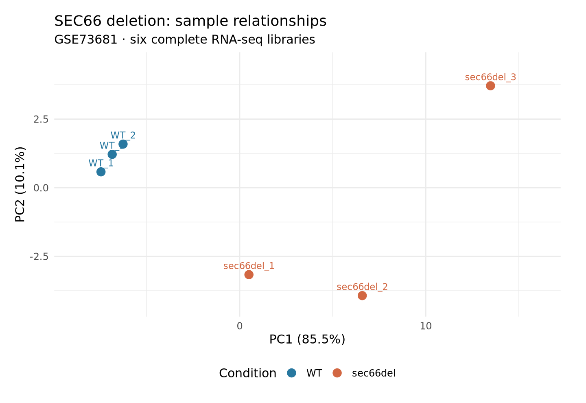
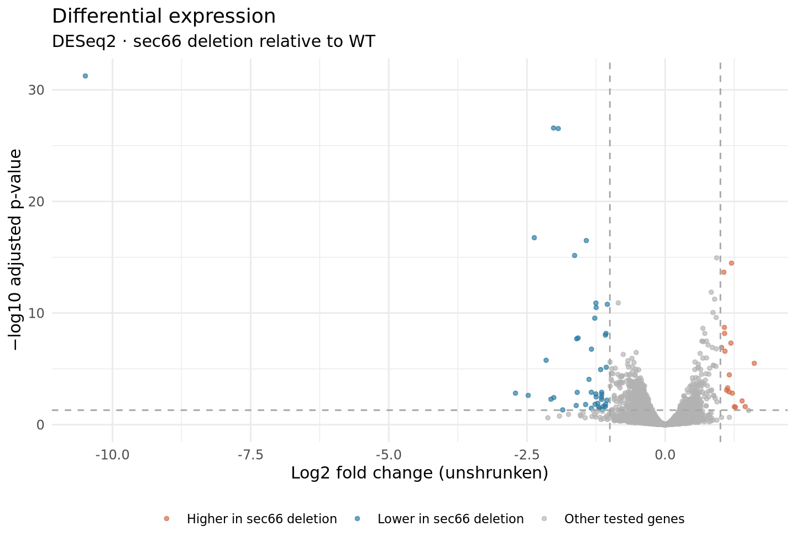

# Linux RNA-seq reanalysis: SEC66 deletion in yeast

A reproducible learning project that starts with complete public sequencing reads and ends with gene-level differential expression in R. The workflow runs in Ubuntu Linux on an Apple Silicon Mac, using a dedicated Conda environment.

**Question:** Which genes show altered RNA abundance in *Saccharomyces cerevisiae* cells lacking SEC66, compared with wild-type cells?

## Data

- GEO: [GSE73681](https://www.ncbi.nlm.nih.gov/geo/query/acc.cgi?acc=GSE73681); BioProject: [PRJNA297664](https://www.ncbi.nlm.nih.gov/bioproject/PRJNA297664).
- Three independent wild-type isolates and three SEC66-deletion isolates, as described in the GEO design.
- Poly(A)-selected, stranded RNA-seq; Illumina HiSeq 2500; single-end, 51-base reads.
- All six complete FASTQ files are downloaded from ENA, with their published byte sizes and MD5 checksums verified. No read downsampling is used.
- Reference: Ensembl release 115, *S. cerevisiae* R64-1-1, with FASTA and GTF from the same release.
- Original study: [Katta et al., 2015, Genetics](https://pubmed.ncbi.nlm.nih.gov/26510791/). The sequencing and biological experiments were performed by the original investigators.

| Sample | Condition | GEO sample | ENA/SRA run |
|---|---|---|---|
| WT_1 | Wild type | GSM1900735 | SRR2549634 |
| WT_2 | Wild type | GSM1900736 | SRR2549635 |
| WT_3 | Wild type | GSM1900737 | SRR2549636 |
| sec66del_1 | SEC66 deletion | GSM1900738 | SRR2549637 |
| sec66del_2 | SEC66 deletion | GSM1900739 | SRR2549638 |
| sec66del_3 | SEC66 deletion | GSM1900740 | SRR2549639 |

Source metadata and exact download checksums are retained under `metadata/`.

## Methods

```text
GEO experiment metadata → ENA FASTQs → FastQC
  → fastp adapter trimming / quality filtering → FastQC
  → HISAT2 → sorted BAMs → featureCounts
  → raw integer count matrix → DESeq2 → tables and figures
```

1. **Quality control:** FastQC before and after preprocessing; MultiQC combines the reports. FastQC warnings are reviewed in the context of RNA-seq, rather than treated as automatic exclusion criteria.
2. **Preprocessing:** fastp removes the documented TruSeq adapter sequence. Bases below Q20 count as unqualified; reads with more than 40% unqualified bases or a post-trimming length below 25 bases are removed. Reads are not deduplicated. No aggressive sliding-window quality trimming is applied.
3. **Alignment:** HISAT2 uses annotation-derived splice sites and exons. The intron range is 20–10,000 bases. Reads are aligned without a strand constraint, allowing the library orientation to be assessed during counting. SAMtools sorts and indexes each BAM.
4. **Counting:** featureCounts groups exons by `gene_id`; MAPQ must be at least 10. Multi-mapping reads and reads ambiguously overlapping multiple genes are excluded. Because these are single-end libraries, reads are counted rather than paired fragments.
5. **Strand validation:** forward, reverse and unstranded counts are compared for all six libraries. A direction is accepted only when its assigned count exceeds 80% of the unstranded count and four times the opposite-strand count in every sample. Evidence is written to `metadata/strandedness.json`; unclear orientation stops the analysis.
6. **Differential expression:** DESeq2 receives the raw integer matrix. Genes with at least 10 reads in at least three samples are retained. The design is `~ condition`; the contrast is **SEC66 deletion versus WT**, so positive log2 fold changes indicate higher expression in the deletion group. No pairing or unreported batch structure is assumed.
7. **Statistics and visualisation:** DESeq2's Wald test, independent filtering and Benjamini–Hochberg adjustment are used. The main report gives both all genes with `padj < 0.05` and the subset additionally satisfying `|log2FC| >= 1`. This second rule is an effect-size filter, not a test of a nonzero effect-size threshold. PCA uses variance-stabilised counts; fold changes shown in tables and plots are unshrunken estimates.

## Results

The complete workflow ran successfully on **28 September 2026**. No samples or reads were subsampled. See [results and QC interpretation](RESULTS.md) and the original execution logs.

| Metric | Observed result |
|---|---:|
| Count matrix | 7,127 genes × 6 samples |
| Genes retained for DESeq2 | 5,657 |
| Read retention after preprocessing | 99.918%–99.928% |
| Overall alignment rate | 95.27%–96.83% |
| Assigned reads / retained reads | 78.73%–79.82% |
| Validated library direction | Reverse-stranded (`featureCounts -s 2`) |
| Genes with adjusted p-value < 0.05 | 755 |
| Also satisfying absolute log2 fold change ≥ 1 | 61 |
| Higher / lower in SEC66 deletion, using both thresholds | 17 / 44 |

SEC66 itself has log2 fold change **−10.49** and adjusted p-value **5.65 × 10⁻³²**, consistent with its deletion. This is a useful internal check, not independent validation of every differential-expression result.

PCA separates the conditions along PC1 (85.5% of variance in the 500 most variable genes), but the deletion replicates are visibly more dispersed than wild-type replicates. All six samples were retained; the variability limits confidence in broad biological conclusions. FastQC flags for base composition and duplication persist after preprocessing and are documented in the results report.




## Reproduce

On Linux ARM64, clone the repository and create the pinned Conda environment:

```bash
git clone https://github.com/Luminary-Chanel/linux-rnaseq-sec66.git
cd linux-rnaseq-sec66
bash scripts/setup_conda.sh
source ~/miniforge3/etc/profile.d/conda.sh
conda activate rnaseq
bash scripts/run_pipeline.sh
```

The repository is private, so cloning requires access. See [中文使用说明](使用说明.md).

The validated run used Ubuntu 24.04 ARM64 with 3 CPUs and 4 GiB RAM. The resolved environment and explicit package lock are saved under `config/`. On another architecture, use an appropriate Conda installation and solve `environment.yml` in a fresh environment; the ARM64 lock is architecture-specific and other platforms have not been tested here. Allow approximately 15 GB of free disk space for the environment, downloads and intermediate files.

The script reuses verified downloads and completed preprocessing/alignment steps. If analysis parameters or references change, use a fresh output directory so stale intermediate results cannot be reused. Do not start two runs in the same directory.

## Outputs

| Path | Contents |
|---|---|
| `results/multiqc/multiqc_report.html` | Interactive QC summary |
| `results/sample_qc.tsv` | Read retention, alignment and assignment rates |
| `results/counts/count_matrix.tsv` | Raw gene-by-sample integer counts |
| `results/counts/normalized_counts.tsv` | DESeq2-normalised counts for interpretation |
| `results/differential_expression/all_tested_genes.tsv` | All retained genes, effect sizes and statistics |
| `results/differential_expression/DEGs_FDR05_absLFC1.tsv` | FDR/effect-size filtered gene list |
| `results/figures/` | PCA, MA, volcano and top-gene heatmap |
| `metadata/tool_versions.txt`, `metadata/R_sessionInfo.txt` | Actual software versions |
| `logs/` | Individual tool logs and overall execution record |

Large raw FASTQs, BAMs, reference files and the virtual machine are not intended for GitHub. Download provenance, scripts, environment files and compact results are sufficient to reproduce this project.

## Interpretation and limitations

This is a new reanalysis of a published experiment, not an exact reproduction of its original TopHat/edgeR/Ensembl 72 analysis. Differences in annotation, software and filtering may change the gene list. Three biological replicates per condition support an introductory comparison but limit power and outlier assessment. A change in RNA abundance does not by itself establish a change in protein abundance or a direct regulatory mechanism.

The environment, scripts and documentation were assembled with AI assistance. This project should be described as an AI-assisted public-data reanalysis; independent proficiency should be demonstrated by rerunning the workflow and explaining its choices and outputs.

## Software documentation

- [FastQC](https://www.bioinformatics.babraham.ac.uk/projects/fastqc/)
- [fastp](https://github.com/OpenGene/fastp)
- [HISAT2](https://daehwankimlab.github.io/hisat2/manual/)
- [featureCounts](https://subread.sourceforge.net/featureCounts.html)
- [DESeq2](https://bioconductor.org/packages/release/bioc/vignettes/DESeq2/inst/doc/DESeq2.html)
- [Lima](https://lima-vm.io/docs/installation/)
